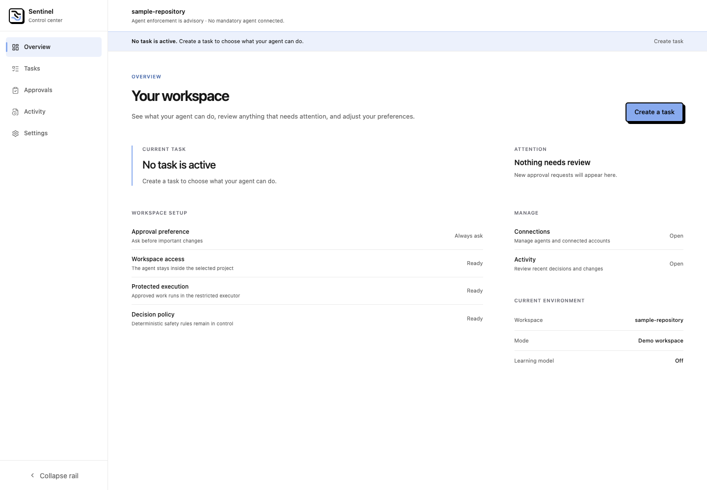

# Sentinel

Sentinel is a local control center for supervising AI agents.

It gives people a clear place to define what an agent is allowed to do, review
important actions before they happen, and understand what the agent did
afterward.



## Why Sentinel exists

AI agents are becoming capable of editing files, running tools, and making
changes on a person's behalf. That power is useful, but it can be difficult to
see where the boundaries are—or whether the agent will respect them.

Sentinel explores a simple idea: important agent actions should happen inside a
task that a person has reviewed.

## How it works

1. **Set the task.** Describe the goal and choose what the agent may change.
2. **Stay in control.** Sentinel pauses important actions for human approval.
3. **Review the activity.** Decisions and completed actions appear in one local
   history.

Approved commands run inside a restricted Docker environment instead of
directly on the host machine.

## What works today

- A local web app for creating and activating task boundaries.
- Human review for sensitive or destructive actions.
- One-time approvals that cannot be reused for a different action.
- One mandatory agent tool path: Cursor's MCP tools for a local issue fixture
  cannot write around Sentinel, and Sentinel stopping prevents the effect.
- Restricted execution with a read-only workspace by default.
- Safe restart recovery that suspends task authority Sentinel could not verify.
- A clear activity history for decisions, approvals, and execution.
- Automated backend and browser coverage for the complete local workflow.

## Current stage

Sentinel is a working prototype and portfolio project, not a production-ready
security product.

It currently supervises one local workspace and one person. One narrow agent
path is now mandatory: with Cursor's sandbox on and Sentinel's hooks
installed, Cursor's tools for a local test issue tracker can only act through
Sentinel, and they fail closed when Sentinel is stopped. Everything else Cursor
can do (shell, file edits, browser) is still advisory because those actions can
happen outside Sentinel. Multi-user accounts, production isolation, and
complete agent interception remain future work.

The current focus is proving that task boundaries and human approvals remain
reliable before expanding the product.

## Explore the project

- [Product architecture](./docs/Product%20Architecture.md) explains the
  security boundaries and design decisions.
- [Roadmap](./docs/Roadmap.md) shows what has been built and what comes next.
- [Control center setup](./web/README.md) explains how to run and test the
  local interface.
- [Threat model](./docs/week1_threat_model.md) describes the risks Sentinel is
  designed to address.

## Local development

Sentinel requires Python 3.11 or newer, Node.js, and Docker Desktop.

Start the web app:

```bash
cd web
npm install
npm run dev -- --hostname 127.0.0.1
```

Then, from the repository root, launch the disposable local demo:

```bash
python3 -m pip install -e ".[test]"
python3 scripts/week11_control_demo.py
```

The demo creates a temporary workspace and opens a one-use local pairing link.
See the [control center guide](./web/README.md) for development checks and more
detail.
