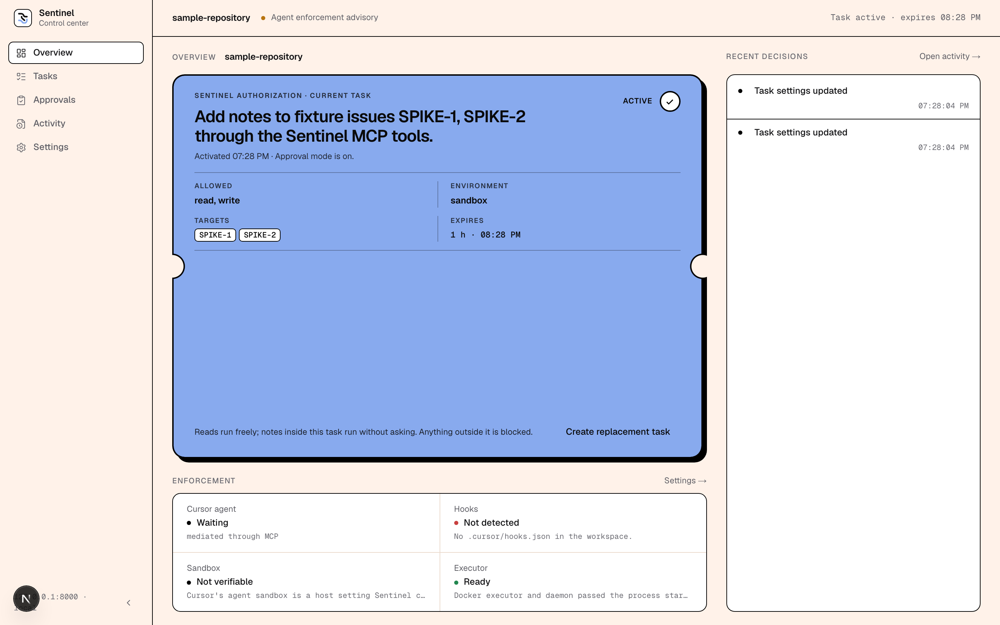

# Sentinel

Sentinel is a local control center for supervising AI agents.

It gives people a clear place to define where an agent is allowed to work,
approve the few actions that genuinely need a human, and understand what the
agent did afterward.



## Why Sentinel exists

AI agents can now edit files, run tools, post messages, and make changes on a
person's behalf. That power is useful, but it is hard to see where the
boundaries are, or whether the agent will respect them. Most tools answer this
by asking for approval constantly, which trains people to click "yes".

Sentinel takes a different view: decide the boundary once, let routine work
inside it run without interruption, and reserve human attention for stepping
outside the boundary or doing something genuinely dangerous.

## How it works

1. **Set the boundary.** A task says where the agent may work and what kind of
   changes it may make. The agent can propose one from inside Cursor, and you
   activate it with one click; or you write one yourself in the control
   center.
2. **Routine work just runs.** Reads and in-scope writes inside an active task
   run without asking, and every one of them is recorded.
3. **Only the edges ask.** Anything outside the boundary is blocked with a
   clear reason the agent can act on. Actions that are risky by nature still
   pause for an exact, one-time approval. You can get those as a desktop
   notification and answer from it.
4. **Review afterward.** Every decision, approval, and completed action appears
   in one local history.

Approved shell commands run inside a restricted Docker environment instead of
directly on the host machine.

## What works today

- A local web app for reviewing, activating, and replacing task boundaries.
- Agent-proposed tasks: the agent asks for what it needs, in a fixed shape it
  cannot widen, and you activate with one click.
- In-scope writes run without a per-action approval; out-of-scope actions are
  blocked; risky actions still ask.
- In-pattern reads can run before any task exists, when the process is
  configured to allow it.
- Desktop notifications for a waiting proposal or approval, with the decision
  made through the same protected route as the on-screen button.
- One-time approvals that cannot be reused for a different action.
- One mandatory agent path: Cursor's MCP tools for a local test issue tracker
  cannot write around Sentinel, and Sentinel stopping prevents the effect.
- Restricted execution with a read-only workspace by default.
- Safe restart recovery that suspends task authority Sentinel could not verify.
- Automated backend and browser coverage for the complete local workflow.

## Current stage

Sentinel is a working prototype and portfolio project, not a production-ready
security product.

It supervises one local workspace and one person. The only mandatory agent
path is a local test issue tracker reached through Cursor's MCP tools, and
only with Cursor's sandbox on and Sentinel's hooks installed. Everything else
Cursor can do (shell, file edits, browser) is advisory, because those actions
can happen outside Sentinel. Real providers (Slack first), a second agent host
(Claude Code), and standing permissions that make routine work click-free
without any task are the next steps; see the roadmap.

## Explore the project

- [Product architecture](./docs/Product%20Architecture.md) explains the
  security boundaries and design decisions.
- [Roadmap](./docs/Roadmap.md) shows what has been built and what comes next,
  including the Week 15 scope decision.
- [Control center setup](./web/README.md) explains how to run and test the
  local interface.
- [Threat model](./docs/week1_threat_model.md) describes the risks Sentinel
  was first designed to address.

## Local development

Sentinel requires Python 3.11 or newer, Node.js, and Docker Desktop.

Start the web app:

```bash
cd web
npm install
npm run dev -- --hostname 127.0.0.1 --port 3100
```

Then, from the repository root, launch the disposable local demo:

```bash
python3 -m pip install -e ".[test]"
python3 scripts/week12_control_demo.py
```

The demo creates a temporary workspace, opens a one-use local pairing link,
and prints the MCP entry to paste into Cursor so the agent can propose tasks
and act through Sentinel. See the [control center guide](./web/README.md) for
development checks and more detail.
