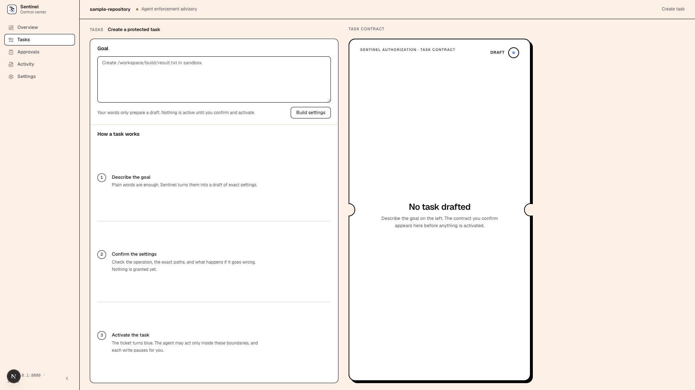
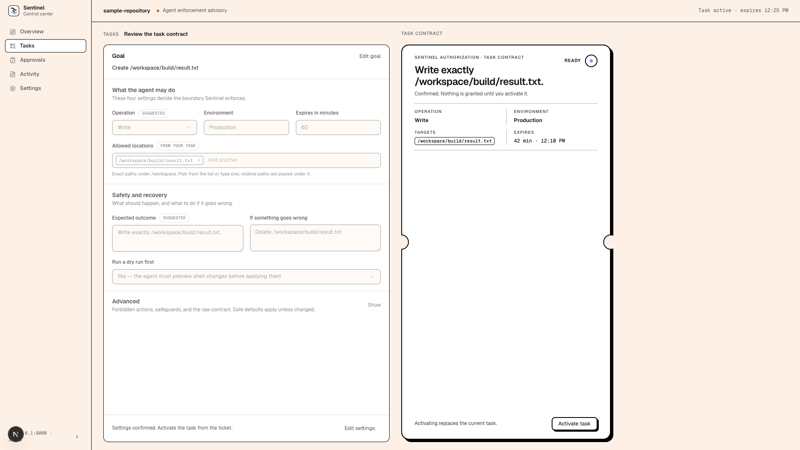
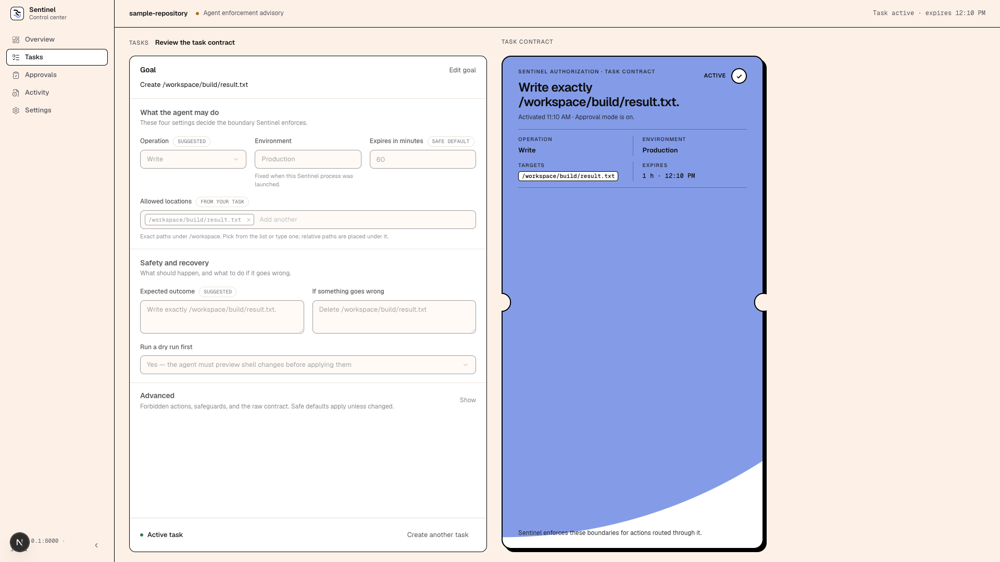

# UI Foundation Handover

Branch: `feature/ui-foundation`, merged to `main` on September 11, 2026
(`7d2c26c`). This was the bounded pass the Roadmap scheduled "Before Week 14".
It changed how the control center looks and how the Tasks page works. It did
not change what Sentinel enforces.

## Read this first if you are new

The control center is the local web page where a person reviews and approves
what an agent may do. Before this pass its five pages were built one at a
time and read as loose lists of text. Now they share one visual system, and
the page a person uses most (Tasks) asks for less typing and forgets less.

Think of it as the difference between a stack of sticky notes and a printed
form with one signature line: the same facts, but you can see at a glance
what matters and where to sign.

## What changed

**One visual system.** Cream page, white panels with a thin black frame, and
a single blue "ticket" that is the only loud element on any screen. The
ticket is the task contract: white while drafting, blue once active, with
notched edges so it reads as a signed ticket rather than a card. Status dots
(green / amber / red) are the only other colour. Fonts are Geist and Geist
Mono. The rules that produced this are written down in
`.cursor/rules/sentinel-ui-style.mdc` so later weeks build on them instead of
around them.

**Every page is a deliberate layout.**

- *Overview:* ticket + 2×2 enforcement panel on the left, vertical decisions
  log on the right; both columns end on the same line.
- *Tasks:* form panel on the left, live ticket on the right, one screen tall.
- *Approvals* and *Activity:* master-detail (list beside detail, both scroll
  inside their panels).
- *Settings:* grouped sections with a left nav.

**Creating a task is simpler and harder to get wrong.**

- "Allowed changes" is gone as a field. It always equals the chosen
  operation, so it can no longer contradict it (the server derives it the
  same way).
- Targets are picked from real workspace paths and fixture issue IDs the
  server suggests (`GET /control/targets`). Typing still works; relative
  paths are placed under the workspace root instead of being rejected later.
- Environment is shown, not chosen: the backend fixes it at launch and
  rejected anything else, which used to surface as an unexplained "can't
  save". Server error details for 404/409/422 now reach the screen.
- One "Confirm task settings" button replaces per-field "Reviewed" checkboxes.
  Activate lives inside the ticket once confirmed.
- A half-finished draft survives switching tabs (kept in the browser tab's
  session storage). A *confirmed* draft deliberately comes back unlocked, not
  "Ready", because the server-side copy may be gone; see Review findings.
- Activation paints the ticket blue from the top-left corner, then the same
  ticket rises as a receipt. Motion is reserved for that one moment and
  honours reduced-motion settings.







**Backend changes (small, all additive).**

- `GET /control/targets` lists workspace paths (as container paths) and
  fixture issue IDs for the picker. Read-only, behind the paired session like
  every control route, skips common noise directories.
- `GET /control/status` now includes `runtime.execution_environment`.
- `SQLiteIssueFixture.list_issue_ids()`.
- The dev launcher `scripts/week11_playwright_server.py` accepts
  `SENTINEL_DEV_REUSABLE_PAIRING=1` so one fixed pairing link serves several
  browsers until the process exits. Dev script only, opt-in, prints a warning;
  the real `PairingService` is untouched and Playwright still exercises the
  one-time behaviour.

## What the tests prove

- 615 Python tests, including the new `/control/targets` contract test and
  the generated TypeScript types staying in sync with the FastAPI schemas.
- 25 mocked Playwright specs, updated for the new copy and layouts, plus new
  steps: a draft survives Tasks → Activity → Tasks; a confirmed draft returns
  as an unlocked draft; the activation paint attribute is set only on that
  transition and produces no animation under reduced motion; Allowed changes
  and Reviewed checkboxes no longer exist.
- `next build` succeeds; lint and typecheck are clean.
- A manual walkthrough of every page and the full create → confirm → activate
  → receipt flow against the real backend, with screenshots above.

## Review findings

An independent Bugbot pass ran on the full diff before merge. One finding,
confirmed real and fixed:

| Finding | Severity | Disposition |
|---|---|---|
| A confirmed draft restored from session storage rendered as "Ready" with a live Activate button even when the server-side proposed contract no longer existed (backend restart, expiry, replacement); the resulting 404 showed only generic text | medium | Fixed. Restore always strips the confirmed copy so the user re-confirms and the server issues a fresh one; the saved draft is cleared once the task is active; 404 details are shown. Test step added. |

Earlier in the pass, Bugbot also caught the Approvals detail panel silently
switching to a newly polled request when nothing was explicitly selected
(fixed by pinning the selection), and `aria-current` being set on every list
row (fixed).

## Decisions made while building

- **Cream + blue over monochrome.** The Roadmap scoped this pass as the
  monochrome "blueprint" set. The user chose, after nine mockups, a cream
  canvas with the original blue ticket and black hairlines, with a Figma-like
  seriousness rather than a marketing feel. Recorded in the project UI rule;
  the personal UI standard was loosened so projects may declare their own
  look while keeping the composition principles (emphasis budget, alignment,
  progressive disclosure).
- **The ticket is the receipt.** The activation confirmation is the same
  ticket geometry, not a separate dialog, so there is one shape that means
  "authority".
- **Pickers over typing, normalise over reject.** Where the server knows the
  valid values, offer them; when the user types anyway, canonicalise rather
  than error later.
- **Draft persistence is convenience, not authority.** Nothing restored from
  the browser can grant anything; confirm and activate always re-validate on
  the server.

## Known limits and things not done

- The scope grew past the Roadmap's "bones only": Tasks, Approvals, and
  Activity were restructured, not just re-skinned. Weeks 14–16 should now
  extend these layouts rather than replace them.
- The dev "Rendering…" pill in the corner is Next.js's dev-mode indicator,
  not Sentinel; on Next 16.3.x it occasionally sticks after a route change. A
  reload clears it. `devIndicators: false` in `next.config.ts` would hide it
  if it becomes a nuisance.
- A hydration warning appears only in Cursor's built-in browser (it injects
  `data-cursor-ref` attributes). It does not occur in a normal browser.
- Not measured: whether the new Tasks form is faster for a person than the
  old one. The Week 13 measurement harness still applies.
- Not tested on narrow viewports beyond the existing 390px Playwright check.

## How to run a walkthrough

From `web/` with the dev server on 3100 (`npm run dev -- --hostname 127.0.0.1
--port 3100`), in a second terminal:

```
SENTINEL_DEV_REUSABLE_PAIRING=1 SENTINEL_WEB_PORT=3100 \
  python3 ../scripts/week11_playwright_server.py
```

Then open `http://127.0.0.1:3100/#pair=playwright-real-control-` followed by
forty `a` characters. With the flag set, the link keeps working for every
browser until the backend stops. Requires Docker and the
`sentinel-executor:local` image. Do not use the flag outside local testing.

## Important implementation files

- `web/src/app/globals.css` — tokens, ticket geometry, paint and receipt
  animations.
- `web/src/components/ui/ticket.tsx`, `layout.tsx` — ticket and panel
  primitives.
- `web/src/components/contract-ticket.tsx` — the contract ticket in all four
  stages and the activation receipt.
- `web/src/app/tasks/` — `page.tsx` (flow, persistence), `contract-form.tsx`,
  `advanced-group.tsx`, `field.tsx`, `draft-form.ts`.
- `web/src/components/target-picker.tsx` — chip input with suggestions.
- `web/src/app/approvals/page.tsx`, `audit/page.tsx` — master-detail.
- `src/sentinel/api/main.py` (`_control_target_suggestions`),
  `control_routes.py`, `control_schemas.py`, `src/sentinel/mcp/fixture.py`.
- `scripts/week11_playwright_server.py` — reusable pairing flag.
- `.cursor/rules/sentinel-ui-style.mdc` — the visual and composition rules.

## Baseline verification commands

```
python3 -m pytest -q
python3 scripts/generate_control_types.py --check
cd web && npm run typecheck && npm run lint && npm run build
cd web && SENTINEL_WEB_PORT=3100 npx playwright test
```
